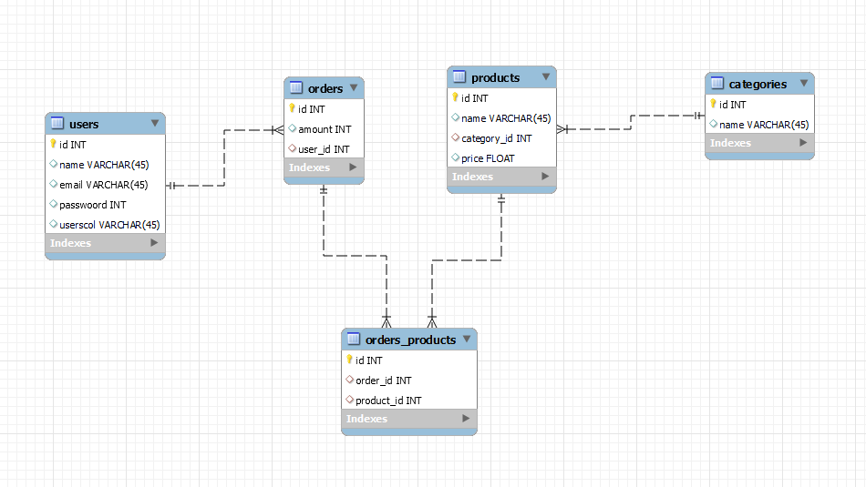
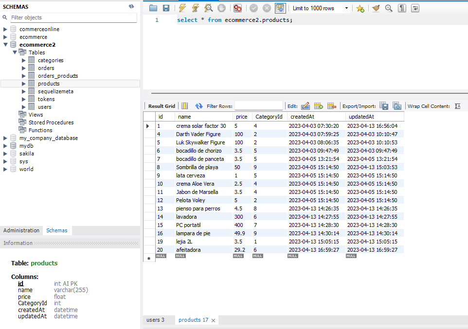
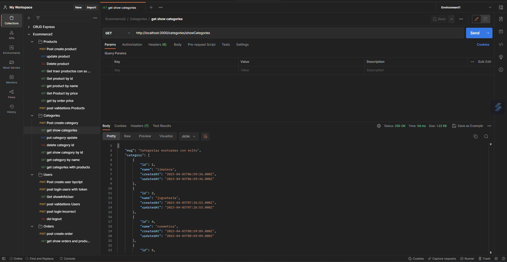
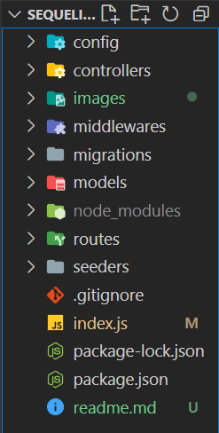

# E-commerce online shopping

_Ecommerce es un proyecto de simulación de backend en el que se recrearán diversas operaciones de una tienda online. Este proyecto esta combinado con los conocimientos adquiridos en las
tecnologías node + express, además de mysql/sequelize._
___
## Objetivos 🚀

Una vez definida la idea del proyecto, el objetivo es generar una API REST que sea capaz de:

* Registro de usuarios usando Bcrypt.
* Login de usuarios + token + middleware.
* Que sea capaz de crear un CRUD.
* Implementar endpoints adicionales de filtrado por diversos items(nombre, id, precios)
* Incluir al menos una relación Many to Many y otra One to Many.
* Utilización de seeders

***
### Requisitos 📋

* Desarrollar la API con mysql, Sequelize y express

* Utilización de Postman para comprobaciones

* Gestión del proyecto desde el inicio en un único repositorio.

* Código limpio, buenas prácticas

___


## Diagrama de relaciones ⚙️

A continuación se muestra el diagrama utilizado para implementar el proyecto y poder desarrollar la base de datos.



En el se observa que hay dos relaciones "One to Many" y una relacion "Many to Many" con las "Foreign Keys" ubicadas en las tablas correspondientes para darse la relación correcta.

---

### Tablas en Mysql 🔩



En esta imagen se ve como queda constituida una de las tablas en Mysql, en concreto la tabla de productos con sus items y la asignación de la categoría a la que va a pertenecer cada producto.

### Modelos 🔩

Además, en el siguiente fragmento de códico se muestra el modelo utilizado para levantar la tabla y las validaciones implementadas.
```js
'use strict';
const {
  Model
} = require('sequelize');
module.exports = (sequelize, DataTypes) => {
  class Product extends Model {
    
    static associate(models) {
      Product.belongsTo(models.Category)
      Product.belongsToMany(models.Order, {
        through:models.Orders_product
      })
    }
  }
  Product.init({
    name: { 
      type: DataTypes.STRING,
      allowNull: false,
      validate: {
        notNull: {
          msg: "Por favor, introduce el nombre del producto",
        },
      },
    },
    price: {
      type: DataTypes.FLOAT,
      allowNull: false,
        validate: {
          notNull: {
            msg: "Por favor, introduce el precio del producto",
          },
        }
    },
    CategoryId: {
      type: DataTypes.INTEGER,
      allowNull: false,
      validate: {
        notNull: {
          msg: "Por favor, introduce categoryId ",
        },
      },
    },
  }, {
    sequelize,
    modelName: 'Product',
  });
  return Product;
};
```
### Controladores y metodos 🔩

Una vez constituidas las tablas, desarrollamos los metodos para realizar los CRUDs rqueridos en los archivos de controlador. En el siguente código vemos como quedan implementadas las importaciones y el primer metodo creado en el archivo controlador de las categorías.

```js

const { Category, Product, Sequelize } = require('../models/index.js'); 
const { Op } = Sequelize;
const CategoryController = {
    create(req, res) {
        Category.create(req.body)
            .then(category => res.status(201).send({ message: 'Categoria creada con éxito', category }))
            .catch((error) => console.error(error));
    },
}

module.exports = CategoryController;
```

### Rutas 🔩

Despues creamos los archivos que van a contener las rutas de acceso en el servidor para poder ejecutar los endpoints.

```js
const express = require('express');///importar express
const UserController = require('../controllers/UserController');//autoimportación
const { authentication } = require('../middlewares/authentications');
const router = express.Router();///Creamos el router

router.post('/createUser', UserController.create);///ruta creada
router.post('/login', UserController.login)
router.get('/showInfoUser',authentication, UserController.getInfoUser)
router.delete('/logout', authentication, UserController.logout)

module.exports = router;
```
### Servidor 🔩

En el siguiente codigo vemos el archivo general "index.js" donde usamos las rutas en el navegador y levantamos el servidor.

```js
const express = require('express'); //exportar express
const app = express(); //inicializamos express 
const PORT = 3000;
app.use(express.json()) //parsea los datos del body, sino es undefined
const { typeError } = require('./middlewares/errors'); //importacion middleware error

///nombre ruta users///
app.use('/users',require('./routes/users.js')) //esta linea anade users a la ruta del servidor//


///nombre ruta products///
app.use('/products',require('./routes/products.js'))

///nombre ruta categories///
app.use('/categories', require('./routes/categories.js'))

//nombre ruta orders///
app.use('/orders', require('./routes/orders.js'))

///aplicacion del middleware///
app.use(typeError)

//////levantar el servidor/////
app.listen(PORT, () => {
    console.log(`Servidor levantado en el puerto ${PORT}`);
})
```
Cabe mencionar también el uso de middlewares para implementar simplifiación en los mensajes de error y dar así mas facilidades al usuario. También la aplicación de autenticación con JWT, además de la creación de un rol de administrador para disponer de permisos especiales.

---
### Postman 🔩

En la imagen vemos las consultas guardadas al comprobar los endpoints y hemos aplicado el método de mostrar las categorías para ver como queda desplegado.



---

### Estructura de código 📋
Por último, mostrar como ha quedado estructurado el proyecto a nivel de organización de código en el editor. Si bien hemos desarrollado los aspectos mas importantes para entender la lógica como: controladores, modelos, rutas, etc. También cabe mencionar las carpetas de configuración, de vital importancia para la creación de la base de datos, las migraciones que se han ido creando en nuestro código y los distintos módulos de node ignorados por git, los seeders para experimentación y los archivos json.

Esta ha sido la distribución final del proyecto en el editor de codigo.



---
## Construido con 🛠️

* [Sequelize](https://sequelize.org/)
* [Mysql](https://www.mysql.com/)
* [Express](https://expressjs.com/es/)
* [Postman](https://www.postman.com/)
* [Visual Studio Code](https://code.visualstudio.com/)
---
## Autor ✒️

* **Jose Llanas** - [jllanas1986](https://github.com/jllanas1986)